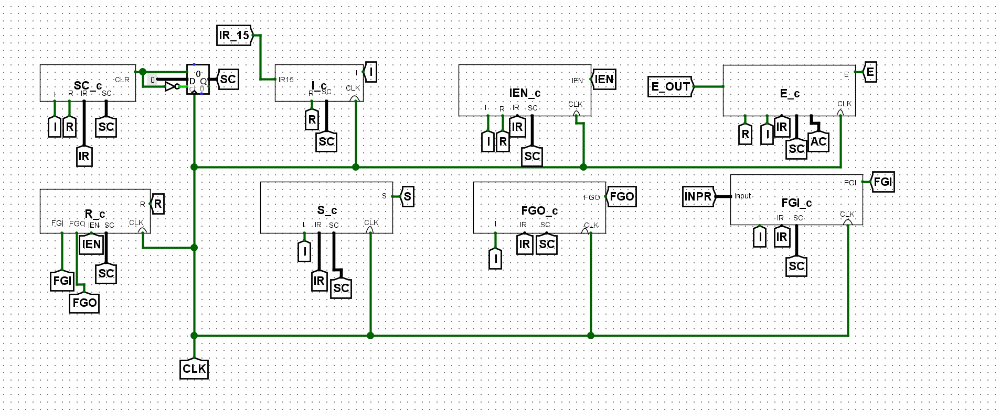
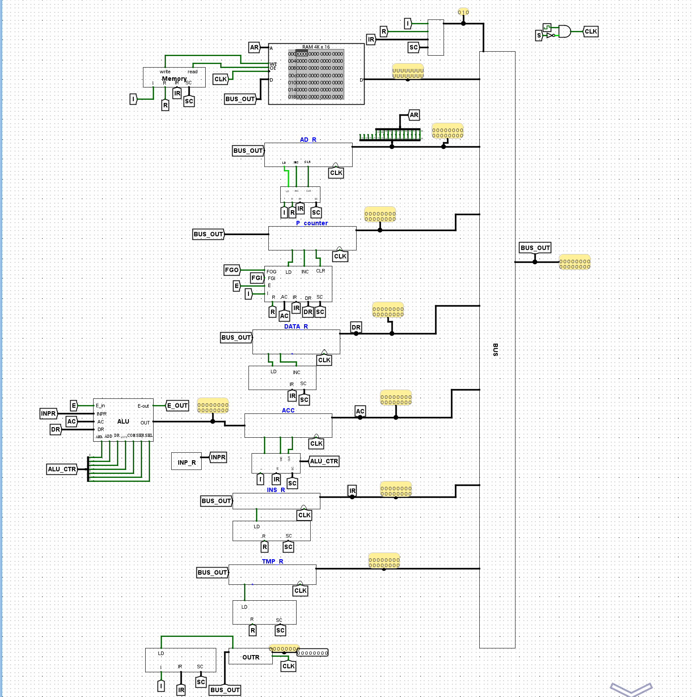

# 16-Bit Basic Computer in Logisim Evolution

A register-transfer-level implementation of a 16-bit basic computer, designed and simulated using Logisim Evolution.

This project was developed as a Computer Architecture course project. It combines a shared system bus, memory, registers, an arithmetic logic unit, and dedicated control circuits into a complete digital computer design.


## Architecture

The design includes:

* 4K × 16-bit memory
* 16-bit shared system bus
* 16-bit arithmetic logic unit
* 1-bit ALU building block
* 12-bit and 16-bit adders
* Address Register (`AR`)
* Program Counter (`PC`)
* Data Register (`DR`)
* Accumulator (`AC`)
* Instruction Register (`IR`)
* Temporary Register (`TR`)
* Input and Output Registers
* Sequence Counter (`SC`)
* Control circuits for registers and status flags

## Design Views

### Datapath

The main datapath connects memory, registers, the ALU, and the shared bus.


### Control Logic

Separate control circuits generate the signals required by the registers, sequence counter, input/output flags, and processor state.



<details>
<summary>View the complete computer circuit</summary>



</details>

## Project Structure

```text
basic-computer-logisim/
├── basic-computer.circ
├── images/
│   ├── computer-overview.png
│   ├── datapath.png
│   └── control-logic.png
└── README.md
```

## Requirements

* [Logisim Evolution 3.9.0](https://github.com/logisim-evolution/logisim-evolution/releases/tag/v3.9.0)

## Running the Project

1. Install Logisim Evolution 3.9.0.
2. Download or clone this repository.
3. Open `basic-computer.circ` in Logisim Evolution.
4. Select the `main` circuit from the circuit explorer.
5. Use the simulation controls to inspect signals and clock behavior.

## Author

Hasti Jahantigh
